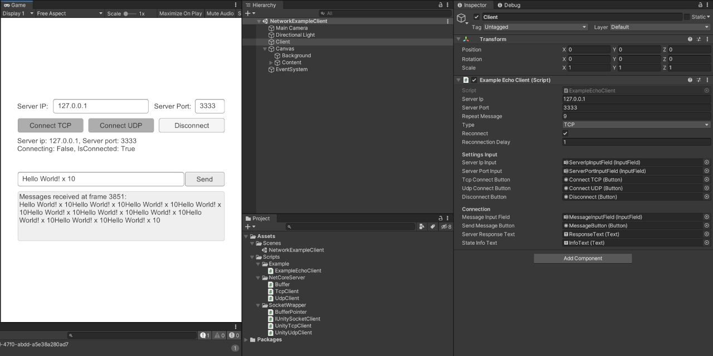

# NetCoreServer Unity Client

*Proof of Concept implementation for using [NetCoreServer](https://github.com/chronoxor/NetCoreServer) with a unity client*

## Features

* Supports SSL, TCP & UDP
* Client code from NetCoreServer with wrappers for unity usage
* Precompiled server executables for windows for easy testing
* Small GC overhead - Usage of MemoryStream
* Async send and receive - Does not block the Main Thread
* Easy to use - Queue for fetching the last received messages
* Tested with local and remote server

| Platform | SSL  | TCP  | UDP  |
| -------- | ---- | ---- | ---- |
| Editor   | ✅    | ✅    | ✅    |
| Android  | ✅    | ✅    | ✅    |
| iOS      | ✅    | ✅    | ✅    |
| Windows  | ✅    | ✅    | ✅    |

## Latest Release

For built binaries take a look at the [latest release](../../releases/latest) 🎉

## Setup

* Unity 2019.3.13f1 (Should work in older versions as well)
* Precompiled servers an in [ServerWindows](./ServerWindows), run the bat you want to test
* Open Scenes/NetworkExampleClient.unity and hit play. 

## TODO

* Split messages back into the sent chunks
* Repeating Asnyc sending results in some packages not being sent
* Support Websockets

## Libraries

* [NetCoreServer](https://github.com/chronoxor/NetCoreServer) by [Chronoxor](https://github.com/chronoxor/)

## License

* MIT - see [LICENSE](./LICENSE)
